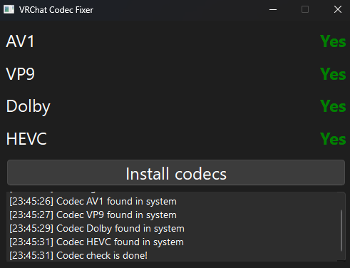

vrc_codec_fixer
---
A project to help VRChat Users fix issues with codecs,

Built on PySide6, using pyinstaller to compress into single executable

## [Download](https://github.com/KotRikD/vrc_codec_fixer/releases/latest)

